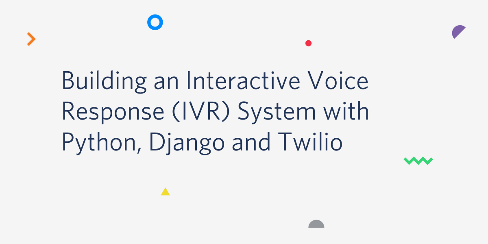

# Example IVR System with Python, Django, Pytest and Twilio

Source code for the article series posted on the Twilio blog:

- [Building an Interactive Voice Response (IVR) System with Python, Django and Twilio](https://www.twilio.com/blog/building-interactive-voice-response-ivr-system-python-django-twilio)
- [Testing a Twilio IVR System With Python and pytest](https://www.twilio.com/blog/testing-twilio-ivr-system-python-pytest)

[](https://www.twilio.com/blog/building-interactive-voice-response-ivr-system-python-django-twilio)

## Quick Start

Clone project

```bash
$ git clone git@github.com:hakib/twilio-ivr-test.git
```

Setup using `Make`

```bash
$ make setup
```

This will create the virtual environment, install all the requirements and run the tests. Alternatively, you can setup the project manually.

Create virtual environment

```bash
$ cd twilio-ivr-test
$ python3 -m venv venv
$ source venv/bin/activate
```

Install dependencies

```bash
$ pip install --upgrade pip
$ pip install -r requirements.txt
$ pip install -r requirements-dev.txt
```

Run migrations

```bash
$ python ivr/manage.py migrate
```

Run project (you'll need a twilio account and a secret auth token to accept calls)

```bash
$ TWILIO_AUTH_TOKEN=my-twilio-secret-token ivr/manage.py runserver
```

Run Tests

```bash
$ pytest ivr
```

Run mypy

```bash
$ mypy ivr
```
